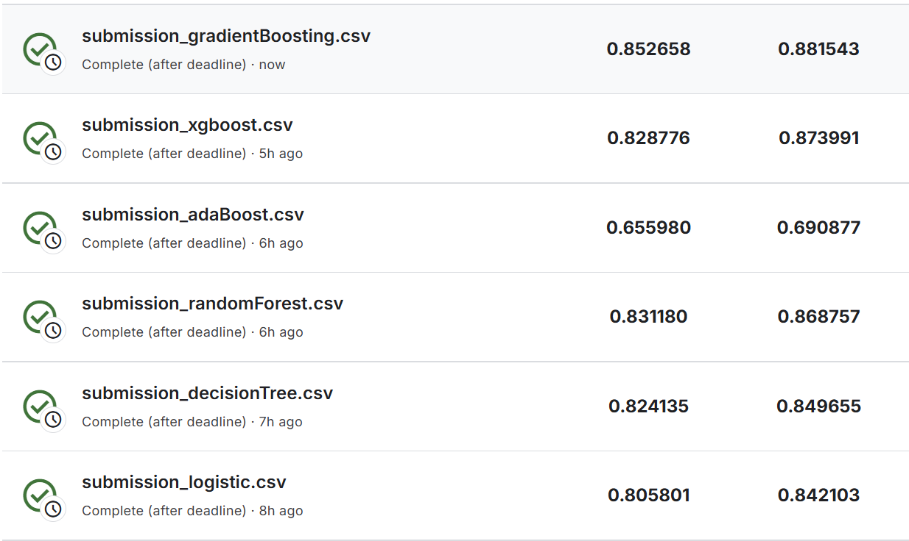

# IEEE-CIS Fraud Detection 

მიზანია ელექტრონული ტრანზაქციების მონაცემებზე დაყრდნობით თაღლითური ტრანზაქციების გამოვლენა. მონაცემთა ბაზა შეიცავს როგორც ტრანზაქციის დეტალებს, ასევე მომხმარებლის იდენტიფიკაციის მონაცემებს. მთავარი გამოწვევა არის კლასების დისბალანსი, დიდი მოცულობის მონაცემები და ანონიმური ცვლადები.

### Cleaning 
* **მეხსიერების ოპტიმიზაცია :** ვინაიდან IEEE მონაცემთა ბაზა საკმაოდ დიდია, დავწერეთ `reduce_mem_usage` ფუნქცია, რომელიც შესაბამისად ამცირებს მონაცემთა ტიპებს (მაგ. `float64` გადაყავს `float32` ან `float16`-ში). ამან მნიშვნელოვნად შეამცირა RAM-ის მოხმარება და აგვარიდა Memory Error-ები.
* **Train/Test Split:** სანამ რაიმე სახის ტრანსფორმაციას ჩავატარებდით, მონაცემები გავყავით Train და Test ნაწილებად (80/20 პროპორციით, `stratify=y` პარამეტრით). ეს კრიტიკულად მნიშვნელოვანია, რათა თავიდან ავიცილოთ მონაცემების გაჟონვა და მოდელმა არ "დაისწავლოს" ინფორმაცია სატესტო სეტიდან.

### Feature Engineering
* **Nan მნიშვნელობების დამუშავება:** 
  * კატეგორიული ცვლადებისთვის გამოვიყენეთ მოდა.
  * რიცხვითი ცვლადებისთვის გამოვიყენეთ მედიანა , რადგან ის ნაკლებად მგრძნობიარეა ექსტრემალური მნიშვნელობების მიმართ.
* **კატეგორიული ცვლადების რიცხვითში გადაყვანა:** 
  * შევქმენით `CustomPreprocessor` კლასი. 
  * დავთვალეთ თითოეული კატეგორიული ცვლადის უნიკალური მნიშვნელობების რაოდენობა.
  * **One-Hot Encoding:** ის ცვლადები, რომელთა უნიკალური მნიშვნელობების რაოდენობა იყო 3 ან ნაკლები, გადავიყვანეთ one-hot ენკოდინგით.
  * **WOEEncoding:** 3-ზე მეტი უნიკალური მნიშვნელობავისაც აქვს მაგათთვის გამოვიყენეთ WOE ენკოდინგი. 
  * **IV:** WOE ენკოდინგის პროცესში დავითვალეთ IV თითოეული მახასიათებლისთვის. აღმოჩნდა, რომ `ProductCD` არის ძალიან ძლიერი პრედიქტორი (IV > 0.5), ხოლო ცვლადები, როგორიცაა `card4`, თითქმის გამოუსადეგარია (IV < 0.02).

### MLflow Tracking
* ინიციალიზებულია DagsHub-ის რეპოზიტორია.
* შექმნილია ექსპერიმენტი

### Feature Selection 
* ლოგისტიკური რეგრესიისთვის გამოვიყენეთ კორელაციის ფილტრი და RFE , თუმცა ხისებრი  მოდელებისთვის კორელაციას ნაკლები გავლენა აქვს. ამიტომ, გამოვიყენეთ თავად მოდელების ჩაშენებული `feature_importances_` ატრიბუტი.
* **მიდგომა:** თითოეული არქიტექტურისთვის ჯერ ვასწავლიდით base მოდელს, ვიღებდით ტოპ 20 ყველაზე მნიშვნელოვან მახასიათებელს და ვლოგავდით MLflow-ში შესაბამის bar chart ერთად. Pipeline-შიც მხოლოდ ეს შერჩეული მახასიათებლები გადაეცემოდა.

### Training და Hyperparameter ოპტიმიზაცია
მაქსიმალური შედეგის მისაღებად გავტესტეთ 6 სხვადასხვა არქიტექტურა. თითოეულისთვის გამოვიყენეთ `GridSearchCV` და 3-fold Cross Validation 

1. **Logistic Regression:**
   * **Hyperparameters:** გავტესტეთ Regularization Strength (`C`: 0.01, 0.1, 1, 10). 
   * **შედეგი:** საუკეთესო აღმოჩნდა C=0.1, რამაც დაგვიცვა Overfitting-ისგან.

2. **Decision Tree:**
   * **მიდგომა:** მოდელი არ საჭიროებს სკალირებას (StandardScaler ამოვიღეთ Pipeline-დან).
   * **Hyperparameters:** `max_depth`  და `min_samples_split`. ამ პარამეტრების შეზღუდვით ავირიდეთ ზედმეტი მორგება overfitting სატრენინგო მონაცემებზე.

3. **Random Forest :**
   * **მიდგომა:** ბევრი გადაწყვეტილების ხის კომბინაცია Variance-ის შესამცირებლად.
   * **Hyperparameters:** ვტესტავდით `n_estimators` და `max_depth`. 

4. **AdaBoost:**
   * **მიდგომა:** მოდელი ეტაპობრივად სწავლობდა Decision Stumps შეცდომებზე. 
   * **Hyperparameters:** გავტესტეთ `n_estimators` და `learning_rate`.

5. **XGBoost :**
   * **მიდგომა:** ყველაზე მძლავრი და სწრაფი მოდელი (გამოვიყენეთ `tree_method='hist'`). 
   * **Hyperparameters:** ვაკეთებდით ოპტიმიზაციას `learning_rate`, `max_depth` და `n_estimators` პარამეტრებზე. 

6. **Gradient Boosting:**
   * **მიდგომა:** XGBoost-ის სტანდარტული წინამორბედი, რომელიც Residuals ასწორებს ეტაპობრივად. 
   * **შეზღუდვები და ანალიზი:** Scikit-Learn-ის `GradientBoostingClassifier`-ს არ გააჩნია `class_weight` პარამეტრი კლასების დისბალანსის სამართავად, რამაც შეიძლება შედარებით დაბალი შედეგი განაპირობოს სხვა ხისებრ მოდელებთან შედარებით. 
   * **Hyperparameters:** გავტესტეთ `learning_rate` და `max_depth`.

**კლასების დისბალანსის მართვა:**
ვინაიდან თაღლითური ტრანზაქციები მონაცემების მხოლოდ ~3%-ს შეადგენს, მოდელების უმეტესობაში ჩავრთეთ `class_weight='balanced'`. ხოლო XGBoost-ის შემთხვევაში დინამიურად დავითვალეთ კლასების პროპორცია და გამოვიყენეთ `scale_pos_weight`, რათა მოდელს მეტი ყურადღება მიექცია მცირე კლასისთვის. საუკეთესო მოდელები კი დარეგისტრირდა DagsHub-ის Model Registry-ში.

### მოდელების შედეგების შეფასება და ანალიზი 

ყველა მოდელის დატრენინგების შემდეგ, თითოეული მათგანით დავაგენერირეთ `submission.csv` და ავტვირთეთ Kaggle-ზე, რათა შეგვეფასებინა მათი რეალური პერფორმანსი უხილავ მონაცემებზე. 

შედეგები ROC AUC მეტრიკით 

**შედეგების ანალიზი:**
1. **Gradient Boosting:** მიუხედავად იმისა, რომ XGBoost უფრო ახალი ალგორითმია, ჩვენს კონკრეტულ შემთხვევაში საუკეთესო შედეგი კლასიკურმა Gradient Boosting-მა აჩვენა (Private: 0.852). მან ყველაზე კარგად შეძლო მონაცემების განზოგადება და თავიდან აირიდა Overfitting.
2. **Random Forest & XGBoost:** ორივე მოდელმა აჩვენა მაღალი და სტაბილური შედეგი (~0.83 Private). Random Forest-ის მაღალი ქულა ადასტურებს, რომ Bagging ტექნიკა ძალიან კარგად უმკლავდება მონაცემების მაღალ Variance-ს. 
3. **Logistic Regression:** მიუხედავად იმისა, რომ ლოგისტიკური რეგრესია მარტივი წრფივი მოდელია, მან საკმაოდ მაღალი შედეგი დადო (0.805). ეს პირდაპირ ამტკიცებს იმას, რომ მონაცემების Preprocessing ,განსაკუთრებით Outlier-ების მართვა და კატეგორიული ცვლადების WOE ენკოდინგი, ძალიან ხარისხიანად შესრულდა.
4. **AdaBoost-ის ჩავარდნა:** AdaBoost ძალიან მგრძნობიარეა ხმაურიანი  მონაცემებისა და Outlier-ების მიმართ. IEEE Fraud dataset სწორედ ასეთი ხმაურიანია, რის გამოც მოდელმა დიდი ალბათობით ზედმეტად მოირგო ეს ამოვარდნები და ვერ ისწავლა ძირითადი თაღლითური პატერნები (მივიღეთ მხოლოდ 0.655).

იყო სერვერის შეფერხებები, აბრუნებდა `500 Internal Server Error` კოდს. მიუხედავად იმისა, რომ მოდელი წარმატებით დარეგისტრირდა MLflow Model Registry-ში , სერვერიდან მოდელის გადმოწერის ეტაპზე კავშირი წყდებოდა პლატფორმის გადატვირთვის გამო.

Kaggle-ზე შედეგების დროულად ასატვირთად და შესაფასებლად, `submission.csv` ფაილების გენერაცია გავაკეტე თითოეული მოდელის სატრენინგო ნოუთბუქშივე, ლოკალურად ,მეხსიერებაში უკვე არსებული საუკეთესო Pipeline-ების გამოყენებით, ნაცვლად Cloud მეხსიერებიდან გადმოწერისა. 

https://dagshub.com/tvada22/ML--Assignment2-IEEE-CIS-Fraud-Detection